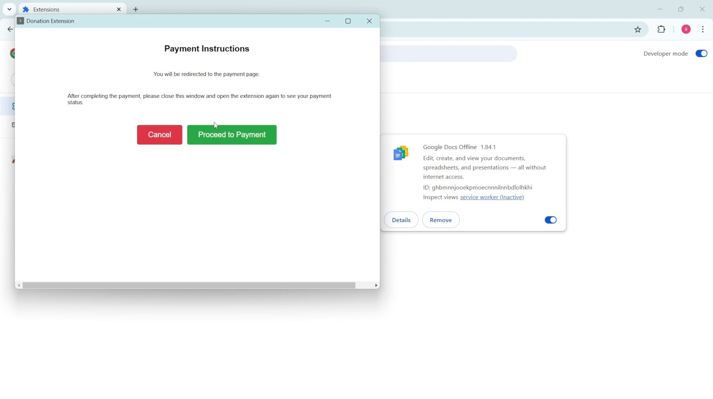

<h1 align="center"><strong>Chrome Extension with Firebase and Stripe Integration</strong></h1>

<p align="center">
  
</p>

<p align="center">
  <a href="https://youtu.be/yW8ACHrYetk?si=7l-KEDf6Gio-99xs">
    
  </a>
</p>

<p align="center">
  <a href="https://youtu.be/Ew9yWHxiJJs">Chrome Extension with Firebase and Stripe Integration</a>
</p>

A Chrome extension that implements Firebase authentication and Stripe payments, allowing users to make donations through a secure payment flow.

## Features

- Google Authentication integration
- Firebase Firestore database integration
- Stripe payment processing
- Popup window interface
- Payment status tracking
- Secure token management

## Requirements

- Node.js and npm
- Chrome browser
- Firebase account
- Stripe account

## Installation

1. Clone the repository
2. Install dependencies:
```
npm install
```

3. Build the extension:
```
npm run build
```

4. Load the extension in Chrome:
   - Open Chrome and navigate to `chrome://extensions/`
   - Enable "Developer mode"
   - Click "Load unpacked" and select the `dist` directory

## Project Structure

### Configuration Files

#### Package.json
The project uses several key dependencies:

Key dependencies:
- `firebase`: Firebase SDK for authentication and database
- `webpack`: For bundling
- `copy-webpack-plugin`: For asset management

#### Webpack Configuration

The webpack configuration:
- Handles multiple entry points (`window.js` and `background.js`)
- Outputs bundled files to `dist` directory
- Implements production optimization
- Copies static assets (manifest, HTML, icons)

### Core Components

#### Manifest
The extension manifest (v3) defines:
- OAuth2 configuration for Google authentication
- Required permissions for identity and tabs
- Content security policy
- Background service worker
- Firebase resource access configuration

#### Firebase Initialization

Initializes Firebase with:
- Authentication
- Firestore database
- Extension-specific configurations

#### Main Window Interface
The extension's UI is defined in `window.html` with:
- Responsive design
- Dynamic content loading
- Styled components

#### Background Script
Handles:
- Extension icon clicks
- Popup window creation

#### Main Application Logic
Implements:
- Google authentication flow
- Payment status checking
- Stripe checkout session creation
- Real-time payment updates
- Error handling
- UI state management

## Development

Run in watch mode:
```bash
npm run watch
```

## Build Process

The build process:
1. Cleans the `dist` directory
2. Bundles JavaScript files
3. Copies static assets
4. Optimizes for production

## Security

- Implements secure token management
- Uses Firebase security rules
- Follows Chrome extension security best practices
- Implements CSP headers

## Firebase Integration

- Uses Firebase Web Extension SDK
- Implements Google authentication
- Stores payment data in Firestore
- Real-time database listeners

## Stripe Integration

- Creates checkout sessions
- Handles payment success/failure
- Implements webhook processing
- Manages payment status tracking

## Error Handling

- Token invalidation handling
- Authentication error recovery
- Payment processing errors
- Network failure handling

## Development Notes

1. Environment setup requires:
   - Firebase configuration
   - Stripe API keys
   - Google OAuth credentials

2. Testing:
   - Load unpacked extension
   - Test authentication flow
   - Verify payment processing
   - Check error scenarios

3. Deployment:
   - Build production bundle
   - Package extension
   - Submit to Chrome Web Store

